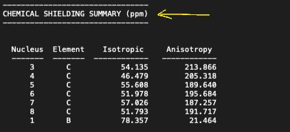
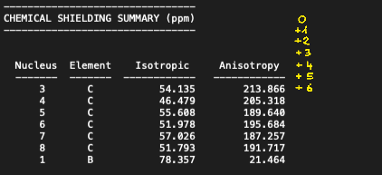

# How to summarize featurization data

## What does it do?

The **Summarize_Featurization_Data.ipynb** Jupyter Notebook reads in all featurization data from the folder structure generated by Featurize.py, truncates it to only contain the data relevant for chemical space generation, and outputs it as a .csv file. Exemplary .csv file are given. To read in the data it goes through the "orca" folders of each substrate and uses a customparser to extract the information of interest. Some of these parameters are then used to calculate additional ones, e.g. HOMO/LUMO energies to calculate electron negativity.

## Step-by-step

### 1) Setup

For the script to properly function, RDkit has to be installed, a few constants need to be defined, and a few files need to be present within the same folder.

Make sure [RDkit](https://www.rdkit.org/) is installed, otherwise install it. This can be done in various ways, depending on your setup and preference. An easy way to install it is via [conda](https://anaconda.org/conda-forge/rdkit).

At the top of the script in the "CONSTANTS" section:

- define the path to the directory holding the "results" folder of the featurization you want to summarize (NOT THE RESULTS FOLDER ITSELF!).
- define the main atom of the functional group you used during the featurization. In its current state, this has to be "B" or "Br" as only these are implemented.
- define the "file_prefix", which is the same prefix chosen during featurization.
- define the "output_name", which is the name of the summarized .csv file.

Finally, create a folder and in it place the **Summarize_Featurization_Data.ipynb** Jupyter Notebook and the dataset.txt file (the one with all the SMILES). Also make sure the results.csv file generated by the second part of the featurization was added to the "results" folder with all the featurization data (Per default its generated in the parent folder of "results").

### 2) Run the script

If you did not compute any additional parameters to the ones that are listed in the main README.md you are ready to run the script. Otherwise you can adjust the parser to also include your additional data. For this refer to the respective **Optional** section below.

To summarize the featurization data:

1) Run the first block of code to import essential modules and define a function to retrieve text from a file.

2) Run the second block to read in your defined constants.

3) Run the third block to change the directory and then initialize the collected_data dictionary. The dictionary is the populated with various parameters by the parser and similar protocols.

4) Run the fourth block to truncate the featurization data to only data that is relevant for the chemical space generation. This data is saved in the plot_data dictionary. As data that is relevant for the chemical space generation we only consider global properties (dipole, HOMO/LUMO energies, etc.) or properties of the carbon attached to the main functional group (with the current setup Br or boronic acids). Incomplete entries are removed completely at this step.

5) Run the fifth block to compile the plot_data dictionary as a .csv file.

### (Optional) Adjust the parser

#### TLDR

To include data in being extracted by the parser we add a new entry to the "params_of_interest" array:

- Open an ORCA output file, find the title of the block of data we are interested in and use it as "keyword".
- Give it an abbreviation to be used for saving.
- Count the lines to the first row of data of interest and use this number as "y_offset"
- Look at the "words" in this line and add the indeces of the ones of interest to the "keep_index" array. Here, we pay attention to keep indeces of Atom Nr, Atom Type, and Value for lists of data (e.g. charges, chemical shielding, etc.) and only the Value index for single values (dipole).

#### Detailed explanation

To adjust the parser you need to add an additional entry to the "params_of_interest" array. The structure of such an entry is as follows:

{
    "keyword": "CHEMICAL SHIELDING SUMMARY",
    "abbr": "CHEM SHIELD",
    "y_offset": 6,
    "keep_index": [0, 1, 2]
}

The keyword has to be a unique string with the ORCA output file and is used to locate the block of results within this file. The "abbr" key is used for the population of the "collected_data" dictionary and can be freely chosen. In our case the parser will open an ORCA output file and search it for "CHEMICAL SHIELDING SUMMARY", which it finds in the following block:

The "y_offset" key then tells the parser how many lines below the one with the "keyword" the data of interest starts. In the example case this is 6 lines below.

The final key "keep_index" is a bit more complicated and does multiple things. In a first step it checks how many indexes the "keep_index" array has. Based on this it collects and treats data slightly different. In the example case the "keep_index" array has a length of 3 (holds 3 elements). Now that we have found the first line with data we want to extract, the parser splits the line into words whenever it finds empty space between letters and writes them into a new array.

For the line "3       C           54.135        213.866" this results in the follwing 0-based (first index is 0) array: ["3", "C", "54.135", "213.866"]. First, the "keep_ideces" are 0, 1, 2. This tells the parser to keep the values of array[0], array[1], and array[2] which are "3", "C", and "54.135". These values are then stored in the "collected_data" dictionary. 

Now that the first line has been extracted and saved there are a few options for the parser to continue, which depend on the length of the "keep_index" array. If its length is

- 1: It saves the desired value and continues with the collection of the next parameter. An example of this type is the dipole.
- 2: Is a special case and exclusively used to extract HOMO/LUMO energies.
- 3: It collects the data for all atoms in a molecule.

In the example case (3 keep_indeces) the parser knows how many atoms are present in the current molecule and hence does not stop after the first line but continues until it collected the data of all atoms. This generally works because this type of data is always reported by ORCA in a similar way as shown in the images above: Atom Nr, Atom Type, Value, (Value), ...

Thus if we want to add a new entry to the "params_of_interest" array we:

- Open an ORCA output file, find the title of the block of data we are interested in and use it as "keyword".
- Count the lines to the first row of data of interest and use this number as "y_offset"
- Look at the "words" in this line and add the indeces of the ones of interest to the "keep_index" array. Here, we pay attention to keep indeces of Atom Nr, Atom Type, and Value for lists of data (e.g. charges, chemical shielding, etc.) and only the Value index for single values (dipole).